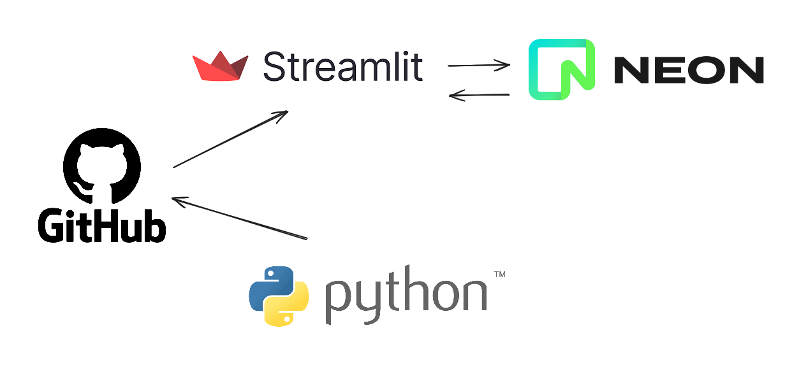

# VAK Learning Style Quiz and Dashboard

Welcome to the Visual, Auditory, Kinesthetic (VAK) Learning Style Quiz! This Streamlit application helps users identify their preferred learning style and provides a dashboard to visualize the results of all participants.

## Overview

The application consists of two main components:

1. **Quiz Page**: Allows users to answer questions to determine their dominant learning style (Visual, Auditory, or Kinesthetic).
2. **Dashboard Page**: Provides aggregated visualizations of all participant responses.

## Features

### Quiz Page

- **User Input**: Users enter their name and complete a series of multiple-choice questions.
- **Result Calculation**: The system determines the dominant learning style based on responses.
- **Database Integration**: User responses and results are stored in Neon cloud database.
- **Visualization**: A bar chart presents the user's learning style distribution.

### Dashboard Page

- **Data Retrieval**: Aggregates results from all quiz participants.
- **Visualizations**:
  - **Bar Chart**: Displays overall learning style preferences.
  - **Donut Chart**: Illustrates the distribution of dominant learning styles.

## Installation

To run the application locally:

`git clone https://github.com/yauheniya-ai/vak.git`

## VAK-Quiz Deployment

The VAK-Quiz is deployed on Streamlit and can be accessed at [https://vak-quiz.streamlit.app/](https://vak-quiz.streamlit.app/).
